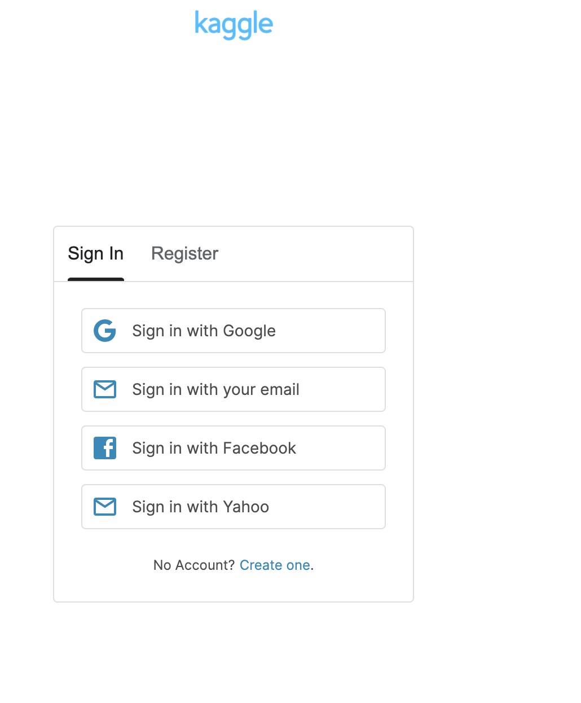
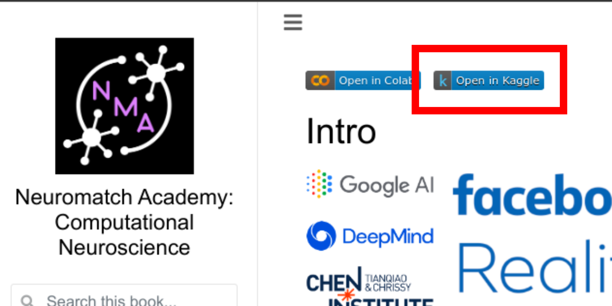
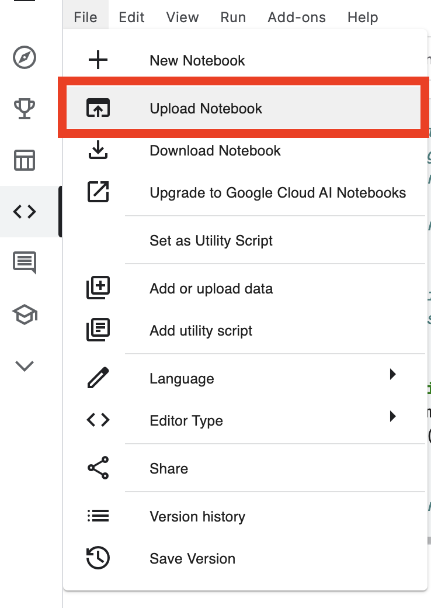
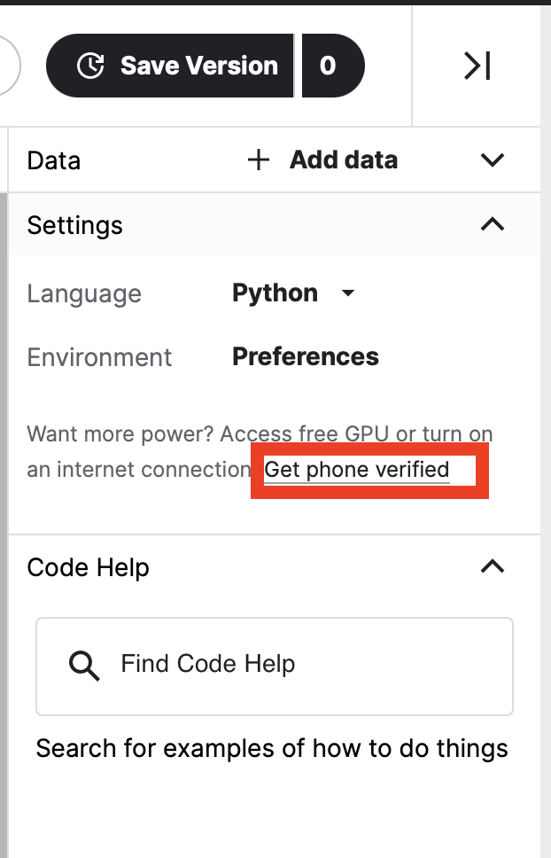
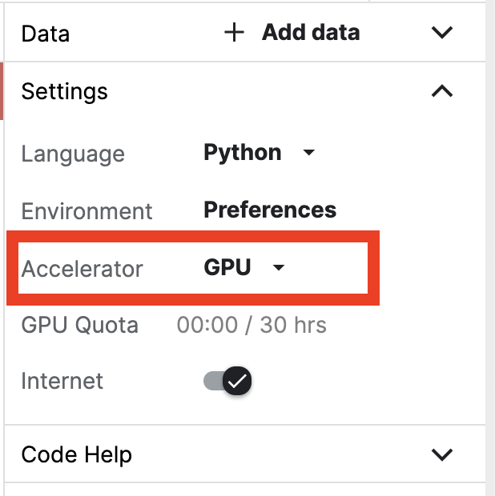

# Steps to run notebooks on Kaggle with GPU support

## STEPS:
1. First, [sign in](https://www.kaggle.com/account/login) to your Kaggle account. If you don't have a Kaggle account, create one by registering for it by clicking [here](https://www.kaggle.com/account/login?phase=startRegisterTab&returnUrl=%2F). 

2. Once you're logged into your account, head over to the left sidebar menu and click on the **Code** section. 

3. Then, click on the **New Notebook** button on the page.

4. In the **File** menu bar, select **Upload Notebook** option.

5. Next, select **Upload via external URL** option, and input the url of the notebook. For instance, if you wish you run [W2D1_Tutorial.ipynb](https://github.com/NeuromatchAcademy/course-content/blob/master/tutorials/W2D1_DeepLearning/W2D1_Tutorial1.ipynb) get its corresponding link (https://github.com/NeuromatchAcademy/course-content/blob/master/tutorials/W2D1_DeepLearning/W2D1_Tutorial1.ipynb), and then select **Upload** button to import the notebook on Kaggle.

6. The last and final step but important **step** about how to leverage **GPU** accelerator in the kaggle kernel. To get access to the GPU, first time users have get their phone numbers verified. In order to have GPU access, on the left sidebar of the notebook under the settings panel, go to **Get phone verified** link and enter your credentials.
   

Once your phone number has been verified, on the left sidebar under **Settings** panel, select **Accelerator** to **GPU** in the drop down menu.
