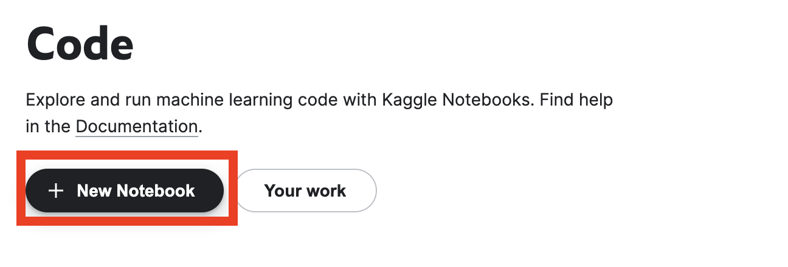

# Steps to run notebooks on Kaggle with GPU support

## STEPS:
1. First, [sign in](https://www.kaggle.com/account/login) to your Kaggle account. If you don't have a Kaggle account, create one by registering for it by clicking [here](https://www.kaggle.com/account/login?phase=startRegisterTab&returnUrl=%2F). 

2. Once you're logged into your account, head over to the left sidebar menu and click on the **Code** section. 

3. Then, click on the **New Notebook** button on the page.

4. 