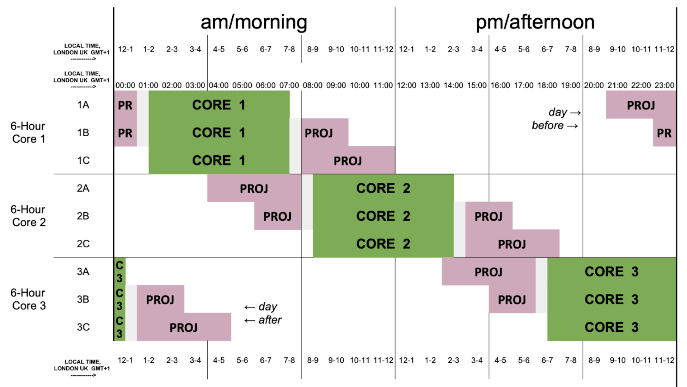

# NeuroMatch Academy (NMA) projects

*July 13-31, 2020*

* [Project Structure and Schedule](#Project-structure-and-schedule)
  * [Week One](#Week-One)
  * [Week-Two-and-Three](#Week-two-and-three)
* [Mentor’s Guide to NMA Projects](#Mentor-Guide-to-NMA-Projects)
* [Student’s Guide to NMA Projects](#Student-Guide-to-NMA-Projects)
  * [Time Commitment](#time-commitment)
  * [Your schedule](#Your-schedule)
* [Data Loaders](#data-loaders)

# **Project materials**
## Links for project introductory videos
- [Curriculum Overview](https://youtu.be/T1VSYU-H8-Y)
- [Projects Intro](https://youtu.be/fNOxmO1Hq3Y)
- [Curated Datasets](https://www.youtube.com/playlist?list=PLkBQOLLbi18ODTckxhgah98JloMLXt4oF)
  * [Stringer Dataset](https://youtu.be/78GSgf6Dkkk)
  * [Steinmetz Dataset](https://youtu.be/WXn4-FpVaOo)
  * [Kay/Gallant Dataset](https://youtu.be/LdJkLyw4yzg)
  * [HCP Dataset](https://youtu.be/iOCcY0QFMS4)
  * [IBL Dataset](https://youtu.be/NofrFH8FRZU)

- [Brainstorming Example](https://youtu.be/H6rSlZzlrgQ)

## Links for project slides
- [Project Instruction](https://mfr.ca-1.osf.io/render?url=https://osf.io/7frh3/?direct%26mode=render%26action=download%26mode=render)
- [Possible Project Proposals](https://mfr.ca-1.osf.io/render?url=https://osf.io/9j38s/?direct%26mode=render%26action=download%26mode=render)

## Project Structure and Schedule

  The NMA projects are conducted over 14 days, beginning on the morning of the ‘second’ curriculum day. Note that the the schedule of NMA is complex, due to the fact that we operate worldwide and have to accommodate three ‘zones’ and many timezones. The timezones are grouped into A, B and C groupings. This is the structure of the NMA times (note: times are in GMT+1):

Daily project time can be
  - A zones — Early — 4h before content
  - B zones — Split — 2h before and after
  - C zones — Late — 4h after content

## Week One

Week one begins on the morning of curriculum day two (project day one),
where the students are introduced to the projects and brainstorm widely on
ideas and questions they would like to explore. For project day three or four,
you will meet with a Pod of students and work with the students to refine their ideas
and form groups around a question. The Pod TA will help with this process, control
the Zoom interactions and support you in this process.
By the end of project day four, the students need to be in final groups, with a specific
project proposal including a question, data set and planned techniques to apply to answer
the question. We are suggesting that the students use the [Miro](https://miro.com) collaborative board for
brainstorming. The project day for the students are:

* **Project Day 1** — General discussion (led by TAs)

  *Extended ice-breaker. Students get to know about each other's 

* **Project Day 2** — Project Structure (led by TAs)
    * Videos: from topic to scientific questions
    * Videos: intros to data sets
    * Videos: overview of course content
    * Pod brainstorm: dreaming big ideas
    
* **Project Day 3** — Refinement (with Mentors)
  * Form project groups of 3–5 students
  * Develop projects from idea to plan

* **Project Day 4** — Refinement (with Mentors)
  * Refine, specify techniques
  * Write short proposal (format TBD)
  
* **Project Day 5** — Groups (led by TAs)
  * The TAs confirm the project groups, projects and the groups will be matched to Mentors.

## Week Two and Three
During weeks two and three, the students will work in their project groups and you and the TAs will alternate in providing support, guidance and discussions. As a Mentor, you should encourage the students to explore, understand and develop their projects. You should also help them stay on track by trying to keep them from pursuing paths that are too difficult for the allotted time or that seem like dead ends. Remember, this is about the experience, not producing a publication-worthy project. All groups must finish their projects by the end of curriculum day 4 of the final week. The students will make a 10min project presentation + recording for presentations and virtual ‘poster session’.

# Mentor Guide to NMA Projects
The Neuromatch Academy projects are small group projects that will help the students build the skill of taking a question and trying to apply concepts or tools from the NMA curriculum. Mentors are a critical component of this process and you will be providing guidance and support for these projects. The primary goals are:
  * Understanding how to develop a clear scientific question
  * Understanding the limits of a particular dataset
  * Understanding how to select the appropriate techniques or tools to answer the scientific question given the available data
  * Interactive discussions with mentors who can provide experience, guidance and support for scientific growth
  * Completing a full cycle of the scientific process: question generation, analysis, generation of a presentation of the findings

We expect mentors to
  * Help students with assessing feasibility of projects (week 1)
  * Help students to solidify ideas and questions, by enforcing clarity
  * Promote course materials and toolkits provided by the NMA
  * Help students use tools like a (neuro)scientist vs like a data scientist 
  * Provide scientific advice, without getting too involved in their projects 
  * Familiarize themselves with the datasets selected for projects

Two important things to remember:
  * The exact question and data set is not important, we are interested in the process
  * The ‘quality’, ‘novelty’ and ‘depth’ of the question and outcome are less important than completing the full cycle from question generation to modeling or analysis to presenting the question and results

As a Mentor, you will have two roles:
- **Week one**: brainstorming and project idea refinement
- **Week two and three**: guiding projects to completion

The NMA students are grouped into Pods, which are run by a TA. The Pods are located in a zone and with a grouping within that zone based on their local timezone. The NMA projects are divided into two components. In week one, you will be assigned to a Pod and will help the students within the Pod refine their project ideas. You should look over the [topics](https://github.com/NeuromatchAcademy/course-content) being covered in the summer school (with an [introduction video](https://youtu.be/T1VSYU-H8-Y)) and try to help them select approaches, concepts and tools to help them answer their scientific question from the curriculum content. We have provided curated datasets and a selection of [project ideas](https://docs.google.com/presentation/d/1WAHfJcBPM4rmwwvreAAS92sRYtltJRwklxH-82NzCYo/edit#slide=id.g8225ef52cb_0_10) provided by the Mentors. By the end of week one, the students should have selected a project that is coherent and can be applied to a dataset (unless purely theoretical/computational) Normally, this should be one of the NMA datasets, but if you feel the students have a clear, just ocoherent plan that is achievable in two weeks working 2h a day, they can use other public datasets.
  
In weeks two and three, you will be assigned to specific projects, matched to your general area of research. Your goal in weeks two and three is to help the students through the process of analyzing data from datasets. The students value the discussion and interactions with Mentors, we would like you to be open to general discussions about science, but you should also ensure the projects are on track.

# Student Guide to NMA Projects
Welcome to the Neuromatch Academy projects! During the next three weeks you will work in small groups to develop a scientific question, select a data set to analyze and work together to develop a project that you will present at the end of NMA. You will be able to see an overview of the curriculum topics to help you brainstorm and we have prepared data sets for your projects. During your project time, you will be meeting with your teaching assistant and to mentors, who will be neuromatched to your projects at the end of week one! You questions you should try to :
1. How do you develop a clear scientific question?
2. What are the limits of a particular dataset?
3. How do you select techniques or tools to answer your scientific question given the available data?
4. Is the scope of the project something you can complete in two weeks—generate a question generation, analyze data, make a presentation of the findings

## **Time commitment**

We have assigned about four hours per day for your projects. However, we know that you will also be doing a lot of work on the curriculum and we want to make sure you balance your project effort with keeping up with the whole NMA. Make sure that you discuss how much effort you think you can manage with the others in your project group. It’s ok if some people want to do more or less, if you agree on a goal that allows everyone to participate as much as they want. But you must seriously consider the amount of work you are planning to do for your project with the amount of effort your group feels it can handle. Remember, it is better to do less but do it well, than try to do more but not be able to complete the work in the time you have.
You will have support from your teaching assistant and your mentors each day, but only for a limited amount of time. Try to organize your questions and have a good discussion with them when they are available so you can use your own time to make progress!
Daily project time can be:

 - A zones — Early — 4h before content
 - B zones — Split — 2h before and after content
 - C zones — Late — 4h after content

## **Your schedule**
Your project time can be
- A zones — Early — 4h before content
- B zones — Split — 2h before and after
- C zones — Late — 4h after content

You need to check with your TA and communicate with your mentors and TAs to make sure you have coordinated when you are meeting!

## Project week one
In your first two days in the NMA curriculum you will learn how to think about modeling and using computational tools to answer a scientific question by analyzing data. You should actively think through the [how-to-model guidelines](https://www.eneuro.org/content/7/1/ENEURO.0352-19.2019). Your first day is just a get-to-know you time, where you should learn about other members of your pod and their interests. By the end of week one, you will need to have formed groups of three to five students! On the second day, we will introduce you to the projects through a series of videos and a teaching assistant led discussion. On days three and four you will meet with a mentor and your teaching assistant to refine your ideas and form groups. On day five, you much have finalized your group, selected a data set and written up a brief description of your project (for neuromatching with your project mentor!).
The goal of week one is to begin by brainstorming and expanding the possible ideas for projects. We are suggesting that you use the [Miro](https://miro.com/) collaborative board for brainstorming. Be broad initially, and try to encourage expansion! But starting on day three, you should focus on refining and narrowing to make sure you have a concrete proposal that you can complete in the following two weeks. We have many [project examples](https://docs.google.com/presentation/d/1WAHfJcBPM4rmwwvreAAS92sRYtltJRwklxH-82NzCYo/edit#slide=id.g8225ef52cb_0_10) provided by the mentors. We have prepared [datasets](), with examples, linked papers, and [videos](https://www.youtube.com/playlist?list=PLkBQOLLbi18ODTckxhgah98JloMLXt4oF) that describe the data sets and experiment. This is science! Most of what we try doesn’t work. That’s okay. Enjoy the process of questioning.

## Week Two and Three
During weeks two and three, you will work in your project groups. The mentors and the TAs will alternate in providing you with support, guidance and general discussions. You must finish your projects your presentations by the end of project day 13 (week three day four). You will prepare a 10min project presentation and a recording for possible presentation to the rest of the NMA regional zone and a virtual ‘poster session’!
Remember you have the entire NMA community who can also help you! Please ask questions in the Neurostars forum and help to answer questions from your fellow NMA classmates!

# Data loaders

## Notebooks

|   | Run | View |
| - | --- | ---- |
| Steinmetz decisions |  | |
| Stringer spontaneous |  | |
| Stringer orientations |  |  |
| Kay images |  |  |
