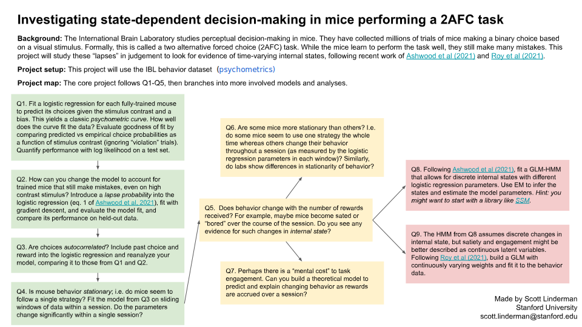

# Guide to choosing a Behavior And Theory dataset

The behavior and theory datasets and project templates are combined into the same topic. They range from projects focused on data analysis (i.e. the Caltech dataset) to pure theory projects where you implement and study a model like a recurrent neural network. Scroll down to see the project templates.

Pure theory projects are usually pursued by more advanced students. If your group is relatively new to neuroscience, you should consider doing a dataset or behavior project *and* include a theory component to it.

Every group can bring up and discuss theory projects. We have several example project templates for this that include code. However, a theory project can go in any direction.

## Caltech

The Caltech dataset ([youtube](https://youtube.com/watch?v=tDmhmasjPeM)) has pose-tracking data from socially-interacting mice, and is well supported with code and a project template.

Credit for data curation: Ann Kennedy

|   | Run | View |
| - | --- | ---- |
| Loader notebook |  |  |

## IBL

The IBL dataset ([youtube](https://youtube.com/watch?v=NofrFH8FRZU)) contains behavioral data collected from 140 mice performing a visual decision-making task.  It includes reaction times and various task-related variables covering the full learning trajectory of each mouse, from naive to expert performance.

Credit for data curation: Eric DeWitt and the IBL team

|                 | Run                                                                                                                                                                                                        | View                                                                                                                                                                                                                       |
|-----------------|------------------------------------------------------------------------------------------------------------------------------------------------------------------------------------------------------------|----------------------------------------------------------------------------------------------------------------------------------------------------------------------------------------------------------------------------|
| Loader notebook |  |  |

## Laquitaine & Gardner, Neuron, 2017

The Laquitaine & Gardner dataset contains behavioral data collected in a motion direction estimation task performed by 12 human subjects. The data include motion direction estimates, reaction times and various task variables recorded for 83,214 trials. The authors varied the strength of sensory evidence (motion coherence) and priors (set of directions) and compared the trial-estimate distribution with the predictions of Bayesian observer models.

|   | Run | View |
| - | --- | ---- |
| Loader & Exploration notebook |  |  |
| Additional analyses |  |  |

## Working memory

|   | Run | View |
| - | --- | ---- |
| Working memory |  |  |

## Motor RNN

We built on [Feulner & Clopath, Plos Computational Biology, 2021](https://journals.plos.org/ploscompbiol/article?id=10.1371/journal.pcbi.1008621) to propose this project. Here we explore how RNN representation dynamics is linked with connectivity structure and task complexity.

|   | Run | View |
| - | --- | ---- |
| Motor RNN |  |  |

## Databases of models

Here is a list of cool databases you might want to use to look for existing models, computational analyses / data processing tools and data. 

| Name                                                  | Model? | Analyses? | Data? | Description                                                  |
| ----------------------------------------------------- | ------ | --------- | ----- | ------------------------------------------------------------ |
| [BioModels](https://www.ebi.ac.uk/biomodels/)         | :+1:   |           |       | **BioModels** is a repository of mathematical models of biological and biomedical systems. It hosts a vast selection of existing literature-based physiologically and pharmaceutically relevant mechanistic models in standard formats. |
| [ModelDB](https://modeldb.science/)     | :+1:   |           |       | **ModelDB** provides an accessible location for storing and efficiently retrieving computational neuroscience models. A ModelDB entry contains a model's source code, concise description, and a citation of the article that published it. |
| [Open Source Brain](https://www.opensourcebrain.org/) | :+1:   |           |       | **Open Source Brain** is a resource for sharing and collaboratively developing computational models of neural systems. |
| [CRCNS](http://crcns.org/)                            | :+1:   | :+1:      | :+1:  | **CRCNS Data sharing website** is a marketplace and discussion forum for sharing tools and data in neuroscience |
| [EEGbase]([http://eegdatabase.kiv.zcu.cz/home-page](http://neuroinformatics.kiv.zcu.cz/articles/read/eegerp-portal-eegbase-_2014-12-19))    |        | :+1:      | :+1:  | **EEGbase** is a system for storage, management, sharing and retrieval of EEG/ERP data, metadata, tools and documents related to electrophysiology. |
| [INCF resources](https://www.incf.org/resources/sbps) | :+1:   | :+1:      | :+1:  | A list of resources endorsed by **INCF**.                    |
| [NITRC](https://www.nitrc.org/)                       | :+1:   | :+1:      | :+1:  | **NeuroImaging Tools & Resources Collaboratory** is an award-winning free web-based resource that offers comprehensive information on an ever expanding scope of neuroinformatics software and data. |

## Additional resources

| Name                                                         | Description                                                  |
| ------------------------------------------------------------ | ------------------------------------------------------------ |
| [figshare](https://figshare.com/)                            | A database of everything research related that's openly shared |
| [Google Dataset search](https://datasetsearch.research.google.com/) | Lets you do a Google search specifically to find datasets    |
| [NeuroVault](https://neurovault.org/)                        | A public repository of unthresholded statistical maps, parcellations, and atlases of the brain. (MRI and PET) |
| [KnowledgeSpace](https://knowledge-space.org/)               | A globally-used, community-based, data-driven encyclopedia for neuroscience that links brain research concepts to data, models, and the literature that support them. |

# Project Templates

Click on each image below to see a full browser version!

## The structure of mouse social behavior

## State-dependent decision-making in mice performing a 2AFC task

## Probing the dynamics of human estimation errors in a Bayesian framework

## The working memory capacity of recurrent neural network models

## Attractor models of working memory

## Linking structure, dynamics and function in recurrent neural networks (RNNs) during motor learning

