# Project Templates

Click on each image below to see a full browser version!

# Flow of information through the brain during a sensorimotor task

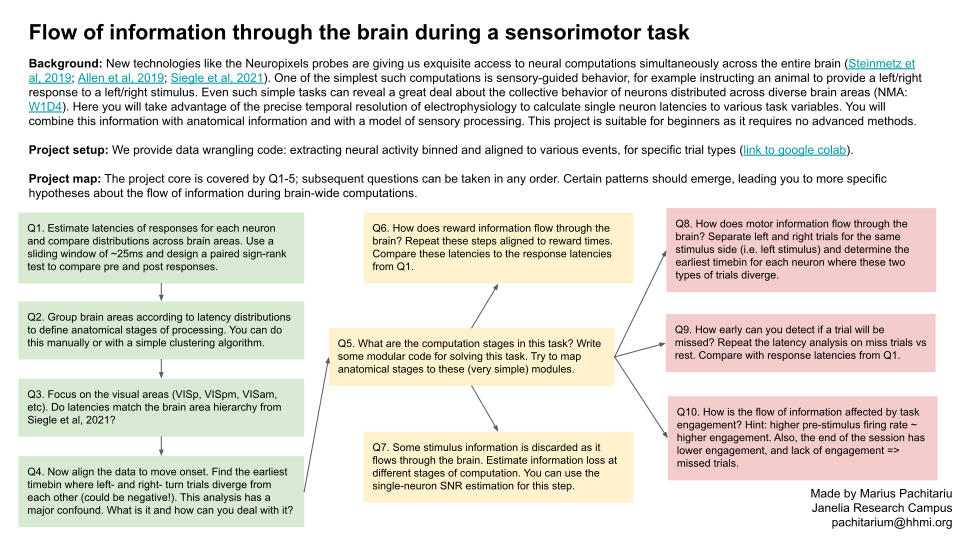

# Effect of stimulus context and behavior state on visual representations

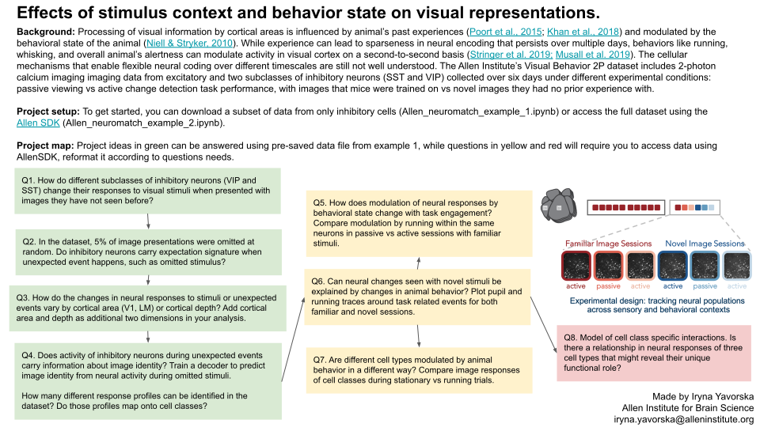

# Behavior representations in mouse visual cortex

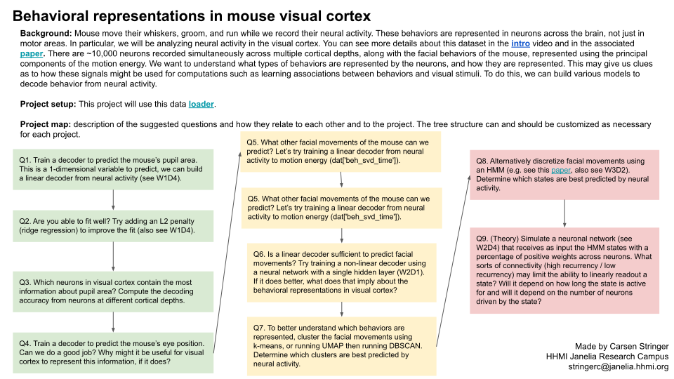

# Mapping brain activation and representation with fMRI

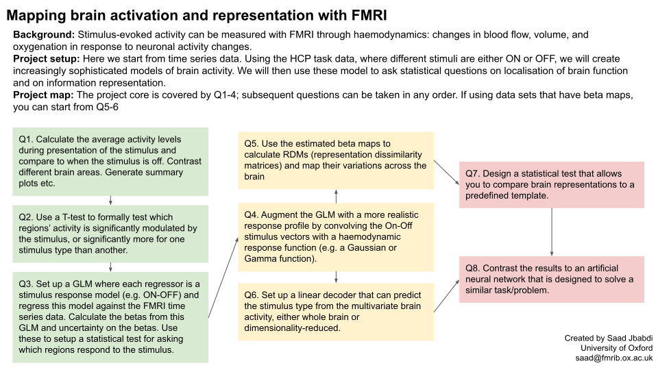

# Retinotopic mapping with FMRI

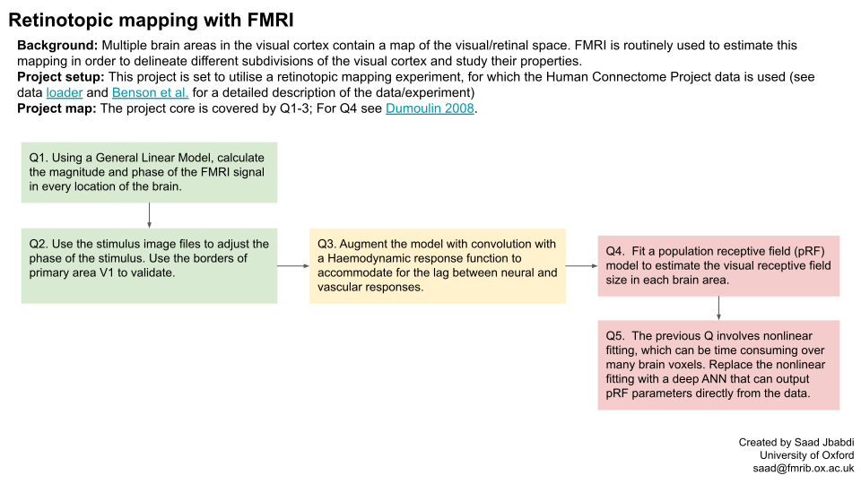

# Modelling of navigational affordances and scene-selective responses

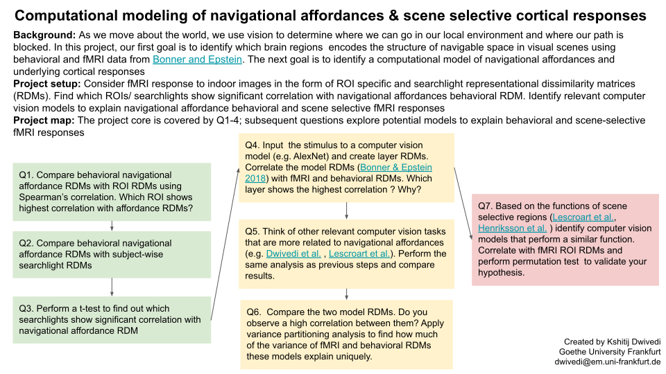

# Visual information in different brain regions

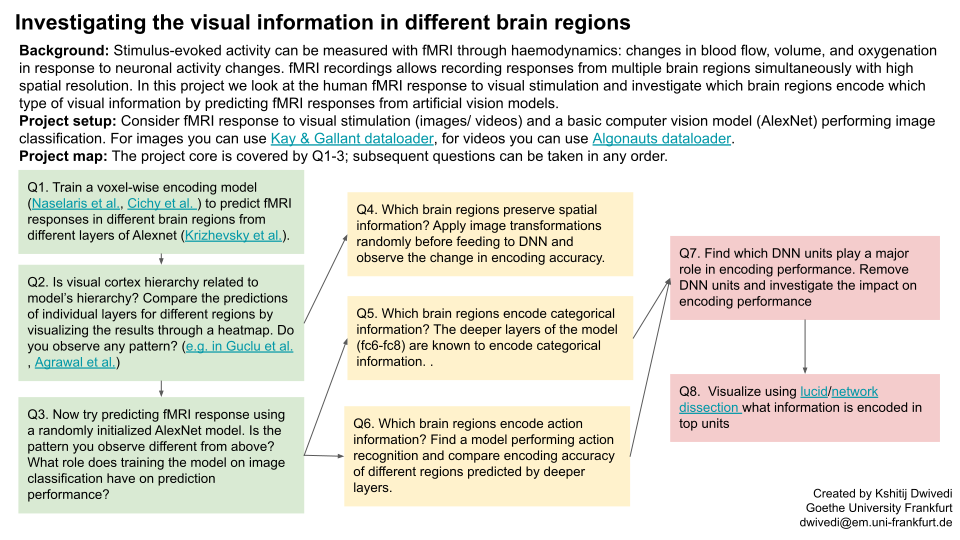

# State-dependent decision-making in mice performing a 2AFC task

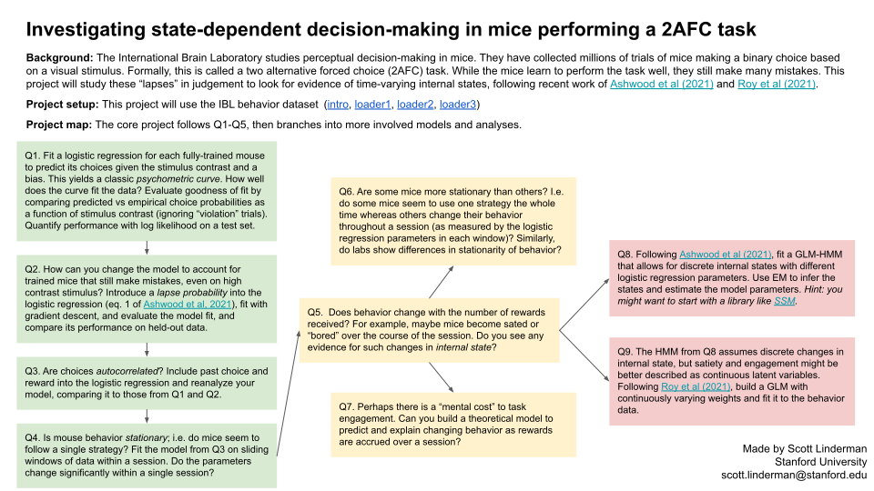

# The working memory capacity of recurrent neural network models

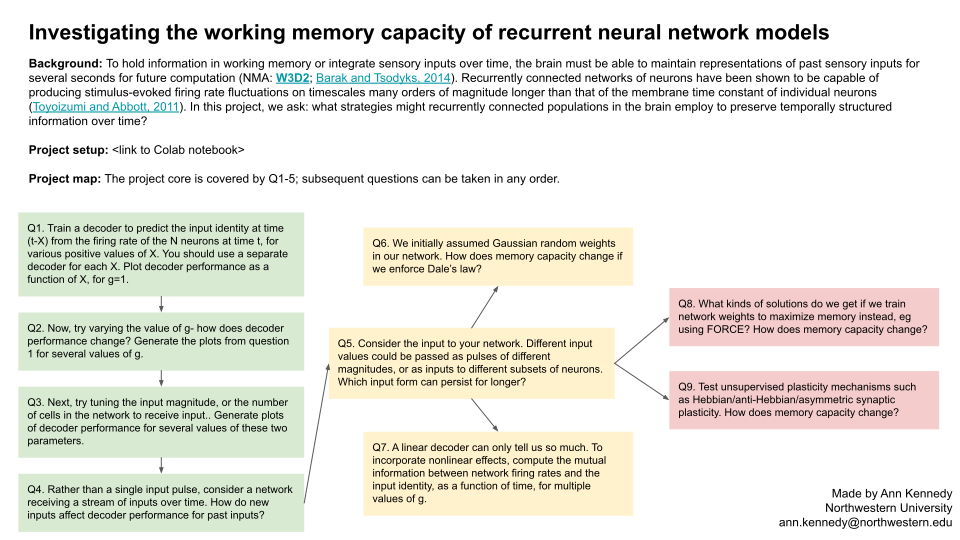

# Attractor models of working memory

# Does neural activity reflect face perception?

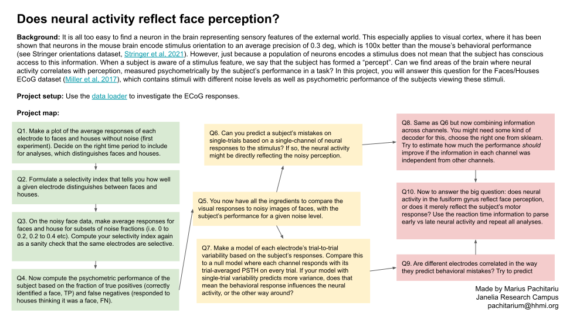

# The structure of mouse social behavior

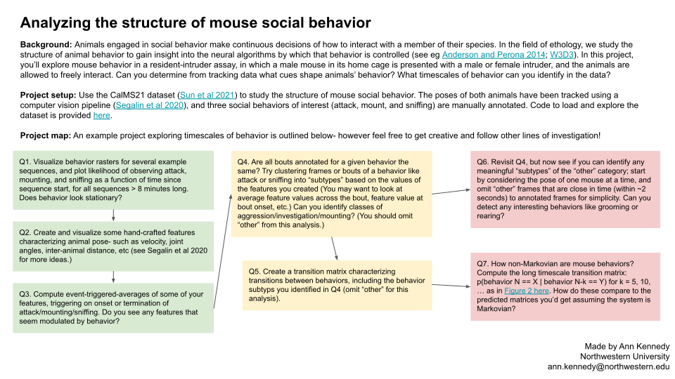
