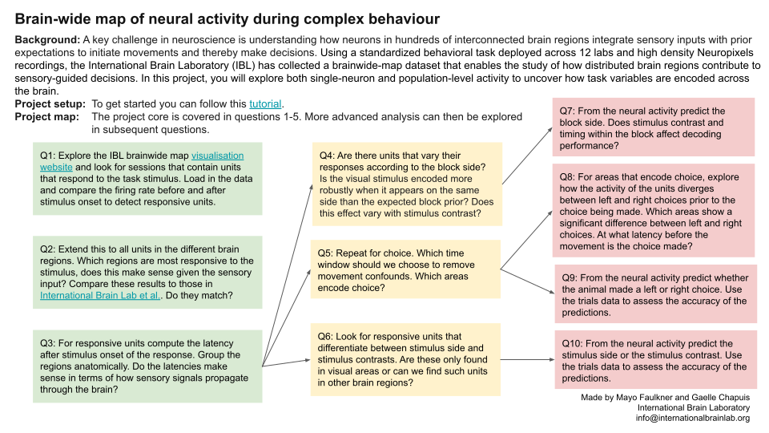
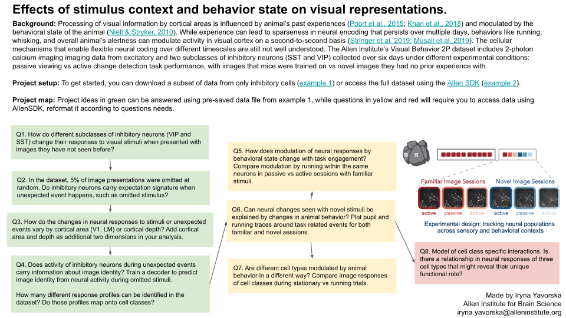

# Guide to choosing a Neurons dataset

Scroll down for project templates associated to these datasets. 

## International Brain Laboratory

The International Brain Laboratory (IBL) brain-wide map dataset ([youtube](https://www.youtube.com/watch?v=N69nvrnmq9g)) includes data from 699 Neuropixels probe insertions across 281 brain regions, recorded during a standardized visual decision-making task. To help users get started, a dedicated project and step-by-step tutorial are available. For more advanced users, the IBL ONE tutorial demonstrates how to access the full range of IBL data using the Open Neurophysiology Environment (ONE) API, enabling deeper exploration and custom analyses across the entire dataset.

Credit for data curation: Mayo Faulkner

|                       | Run                                                                                                                                                                                                                    | View                                                                                                                                                                                                               |
|-----------------------|------------------------------------------------------------------------------------------------------------------------------------------------------------------------------------------------------------------------|--------------------------------------------------------------------------------------------------------------------------------------------------------------------------------------------------------------------|
| Analyze prepared data |  |  |
| IBL ONE tutorial      |               |             | 

### References

- International Brain Laboratory et al. (2023) A Brain-Wide Map of Neural Activity during Complex Behaviour doi: [10.1101/2023.07.04.547681]([https://doi.org/10.1101/2023.07.04.547681])
- Findling et al. (2023) Brain-wide representations of prior information in mouse decision-making doi: [10.1101/2023.07.04.547684](https://doi.org/10.1101/2023.07.04.547684)

## Supervised and unsupervised learning 

The [Zhong et al, 2025](https://doi.org/10.1038/s41586-025-09180-y) dataset ([youtube](https://www.youtube.com/watch?v=o0PFk-lnpuI)) contains simultaneous recordings of up to 80,000 neurons from mouse visual cortex at different stages of visual learning in a virtual reality task with naturalistic images. It also contains recordings made during unsupervised exploration of the same virtual reality environments for comparisons, and recordings made after the introduction of novel stimuli that require behavioral classification.

Credit for data curation: Lin Zhong and Marius Pachitariu

|   | Run | View |
| - | --- | ---- |
| Visual learning |  |  |

### References:

- Zhong L, Baptista S, Gattoni R, Arnold J, Flickinger D, Stringer C and Pachitariu M. (2025) Unsupervised pretraining in biological neural networks. doi: [10.1038/s41586-025-09180-y](https://doi.org/10.1038/s41586-025-09180-y)

- Zhong L et al (2025). Figshare data repository. doi: [10.25378/janelia.28811129.v2](https://doi.org/10.25378/janelia.28811129.v2)

## Allen Institute

The Allen Institute dataset ([youtube](https://www.youtube.com/watch?v=3YP-GYvYnuA)) is new this year, and it was designed to be very friendly for beginners. The mice do a visual change detection task using either familiar or novel images. The recordings are from specific neuron populations (Excitatory, VIP, and SST) in multiple visual cortical brain areas (V1 and LM). This dataset is well supported with code and a dedicated project template. This would provide a more focused experience for beginner groups than the Steinmetz dataset. For more advanced groups, a separate dataloader is available using the Allen Institute SDK, which gives access to the entire dataset for more exploratory analyses. You can learn more about the dataset and find additional description and helpful tools on [Allen Brain Atlas](https://allensdk.readthedocs.io/en/latest/visual_behavior_optical_physiology.html) and [SWDB databook](https://allenswdb.github.io/physiology/ophys/visual-behavior/VB-Ophys.html).

Credit for data curation: Marina Garret, Iryna Yavorska, Doug Ollerenshaw

|   | Run | View |
| - | --- | ---- |
| Analyze one dataset |  |  |
| Access to all data |  |  |

### You can read more about scientific discoveries related to this dataset in our preprint:

- Garrett, M. et. al. (2023) Stimulus novelty uncovers coding diversity in visual cortical circuits. bioRxiv doi: [https://www.biorxiv.org/content/10.1101/2023.02.14.528085v2]

# Project Templates

Click on each image below to see a full browser version!

## Brain-wide map of neural activity during behaviour

## Supervised and unsupervised learning in recordings of 80,000 neurons

## Effect of stimulus context and behavior state on visual representations

