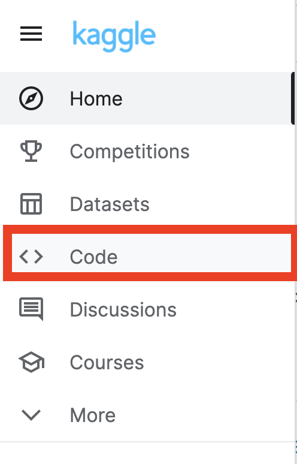
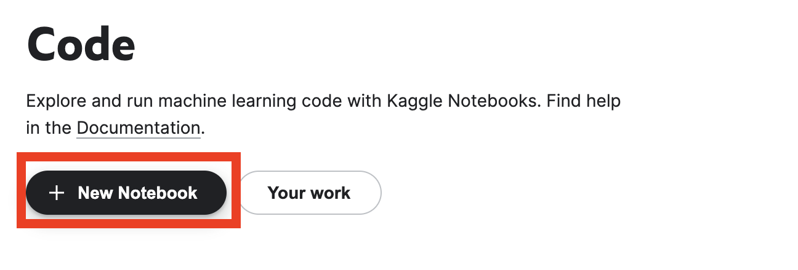
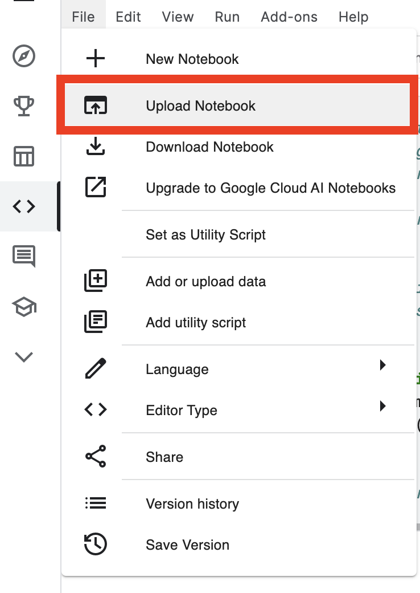
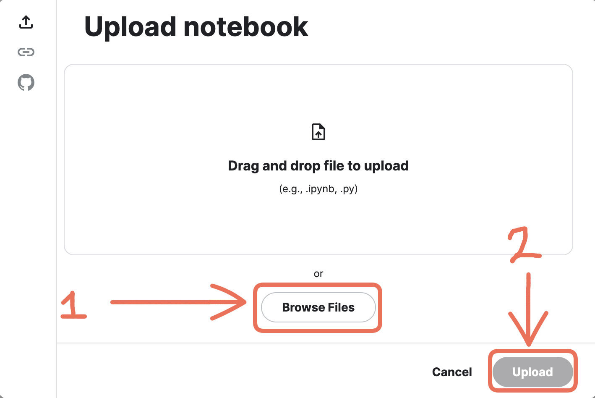
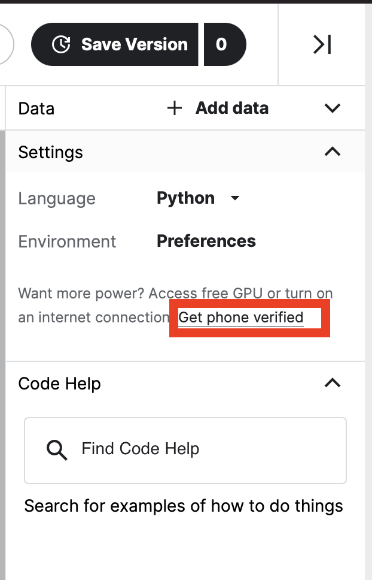
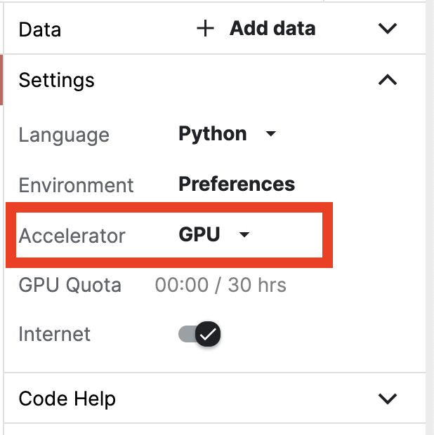

# Using Kaggle

If you are in China or another region with difficult 
access to Google Colab, you can use Kaggle as a substitute for launching an interactive coding environment where you can write and run code. Please note that we recommend Google colab if you can access it.

## STEPS:
**1.** First, [sign in](https://www.kaggle.com/account/login) to your Kaggle account. If you don't have a Kaggle account, create one by registering for it by clicking [here](https://www.kaggle.com/account/login?phase=startRegisterTab&returnUrl=%2F). 

**2.** Once you're logged into your account, head over to the left sidebar menu and click on the **Code** section. 

**3.** Then, click on the **New Notebook** button on the page.

**4.** In the **File** menu bar, select **Upload Notebook** option.

**5.1** Now, download the notebook you wish to import on Kaggle by clicking on the **download** icon located in upper right corner of the webpage.

**5.2** Next, in the **Upload notebook** window, select your  notebook file which you downloaded via **step 5.1** by clicking on **Browse Files** button. Then, finally select **Upload** button to import the notebook on Kaggle.

>**NOTE:-** The last step, that is **step 6** grants you access to GPU in Kaggle. It is **NOT** required for Computational Neuroscience course and is only required for Deep Learning course

**6.** (Optional) The last and final step about how to leverage **GPU** accelerator in the kaggle kernel. You should not need to do this ever for the comp neuro course tutorials. You may want it for project work and especially for the deep learning course. To get access to the GPU, first time users have get their phone numbers verified. In order to have GPU access, on the left sidebar of the notebook under the settings panel, go to **Get phone verified** link and enter your credentials.

Once your phone number has been verified, on the left sidebar under **Settings** panel, select **Accelerator** to **GPU** from **None** using the drop down menu.

